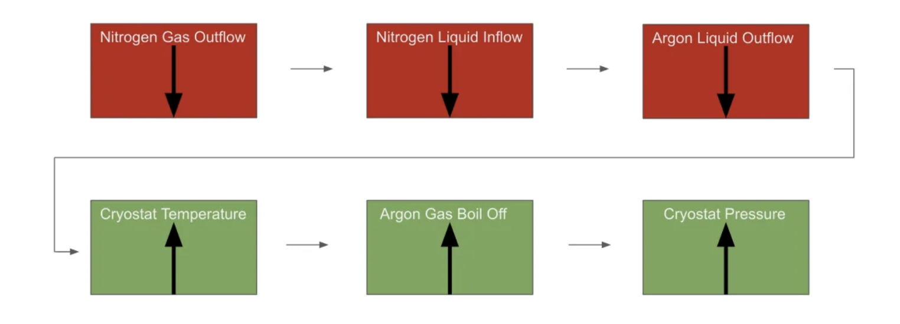
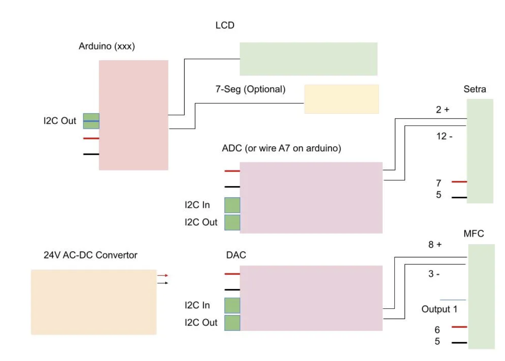
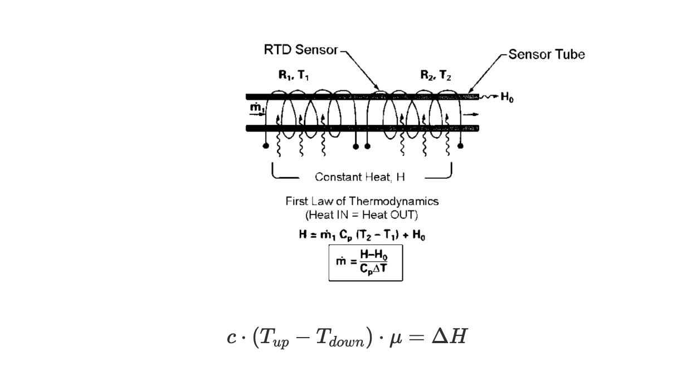
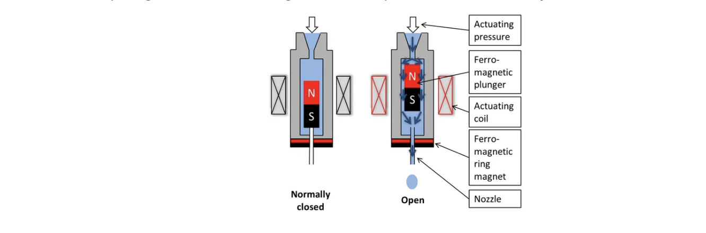
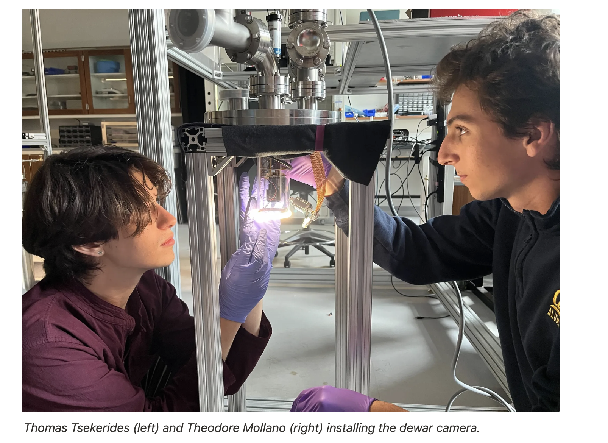

# MFC PID Controller with Argon #1

## Mathematical Derivation of PID Controller


*Figure: Block diagram of the PID control feedback loop.*


A PID (Proportional-Integral-Derivative) controller is a feedback control loop mechanism widely used in industrial control systems. The controller continuously calculates an error value $e(t)$ as the difference between a desired setpoint $r(t)$ and a measured process variable $y(t)$. The controller applies a correction based on proportional, integral, and derivative terms:

$$
V_{out}(t) = k_p e(t) + k_i \int_0^t e(\tau) d\tau + k_d \frac{de(t)}{dt}
$$

Where:
- $k_p$ is the proportional gain (responds to current error)
- $k_i$ is the integral gain (responds to accumulated error)
- $k_d$ is the derivative gain (predicts future error)

In the context of this project, the error is the difference between the setpoint pressure and the measured pressure from the transducer:

$$
e(t) = P_{set} - P_{measured}
$$

The PID output voltage is computed in each loop iteration as:

$$
\mathcal{V}_{out} = k_e \Delta V + k_i \sum_j \Delta \mathcal{V}_j + k_d \frac{\Delta V}{\Delta t}
$$

Where $\Delta V$ is the error at the current step, and $\Delta t$ is the time interval between updates. The integral term is implemented as a running sum, and the derivative as a finite difference. The controller drives the error between setpoint and held pressure to zero, ideally following a negative exponential decay:

$$
\partial_t(\Delta \mathcal{V}) \approx -k_e (\Delta \mathcal{V})
$$

The integral term increases convergence speed and reduces steady-state error. If the set pressure is above the actual pressure, the controller reduces the output voltage, decreasing the mass flow and increasing the pressure in the cryostat.

*See diagrams below for hardware setup:*


*Figure: Physical wiring schematic for the PID controller system.*
---

## Explanation of Sierra Mass Flow Controller (MFC)


*Figure: Heating coil arrangement in the capillary sensor of the MFC.*


*Figure: Schematic showing the mass flow and heat transfer in the MFC.*


The Sierra MFC measures and controls the mass flow of gas using a capillary thermal method. A small fraction of the gas is diverted through a sensor tube with two identical heating coils. When no flow occurs, both coils are at the same temperature. When gas flows, it carries heat from the upstream coil to the downstream coil, creating a temperature differential. This differential is proportional to the mass flow rate:

$$
c \cdot (T_{up} - T_{down}) \cdot \mu = \Delta H
$$

Where:
- $c$ = heat capacity of the gas
- $T_{up}$ = upstream coil temperature
- $T_{down}$ = downstream coil temperature
- $\mu$ = mass flow rate
- $\Delta H$ = heat transferred

Thus, the mass flow rate $\mu$ is proportional to the temperature difference between the coils. The MFC uses an electromagnetic valve (solenoid) to control flow: current through the solenoid generates a magnetic field, actuating a plunger to increase or decrease flow.

For more details, see the [Sierra Capillary Thermal User's Guide](https://www.sierrainstruments.com/userfiles/file/wp-sierra-capillary-thermal-users-guide.pdf).

---

## System Overview and Usage

This controller regulates the outflow pressure from a gas cylinder (argon or nitrogen) using feedback from a pressure transducer. The Arduino interfaces with the transducer and MFC via I2C, adjusting the MFC drive voltage to maintain setpoint pressure.

### To Run the PID Controller:

1. Navigate to the system control directory:

    ```bash
    cd ../dark_matter-server/manageDetectorDevices/System_Control
    ```
2. Run the GUI or setpoint scripts:

    ```bash
    python3 gui.py
    python3 gui_new-setvalues.py
    ```
   
   Or, alternatively, run the shell script:

    ```bash
    ./PID.sh
    ```

   (Ensure all hardware is connected and powered.)

---

## Background and Physical Principles

- Increasing nitrogen gas outflow increases nitrogen liquid inflow, producing more argon liquid via the LAr condenser. More argon outflow decreases cryostat temperature and pressure. The inverse holds for decreased nitrogen flow.

- The PID controller is implemented in Arduino code, using I2C to communicate with MCP3428 ADC and DAC chips. The output voltage (0-5V) is sent to the MFC to control flow.

---

## Repository Structure

- `Arduino_Code/` — Arduino programs for PID and device control
- `Debug/` — Test scripts for component verification
- `System_Control/` — Python scripts for system-level control and integration

---

## About the Team


*Figure: The Giovanetti Lab team working on the PID and MFC project.*

---

##  *Williams Dark Matter* Giovanetti Lab Scripts and Things


The following repository contains scripts to interface with PID controllers and Arduinos, and Raspberry Pis. 

There are three folders in this repository: 

 - Arduino_Code
 - Debug
 - System_Control

Arduino_Code contains various arduino programs that one should be able to access and modify outside the lab
Debug contains test scripts that can be used to control and verify that components are working correctly
System_Control contains scripts to interact with various lab instruments, which will work in conjunction with slowcontrol, from _Princeton's Dark Matter Detector Lab_

To execute a python file run python3 xxx (where xxx) is the filename
To execute an arduino file, make sure device is plugged in an click file, open in editor
